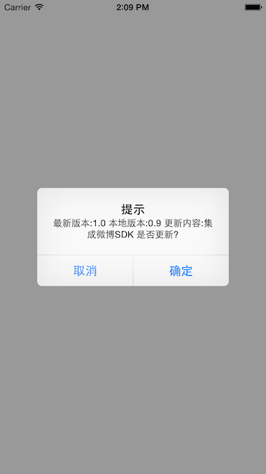

# FirVersionCompare

基于fir.im应用分发网站的Version Compare 工具类

## 使用

将FirVersionCompare文件夹添加到工程

	#import "FirVersionCompare.h"

	@interface AppDelegate ()

	@end

	@implementation AppDelegate

	- (BOOL)application:(UIApplication *)application didFinishLaunchingWithOptions:(NSDictionary *)launchOptions {
    	// Override point for customization after application launch.
    	[FirVersionCompare compareVersionWithAppKey:@"54894d31d408a67b03001724"];
    	return YES;
	}    
详细见FirVersionCompareDemo

## 注意

* FirVersionCompare 内集成了第三方类库UIAlertView+Blocks，注意不要和你的工程冲突
* FirVersionCompare 理论支持iOS5+，但是只在iOS7、iOS8下测试过